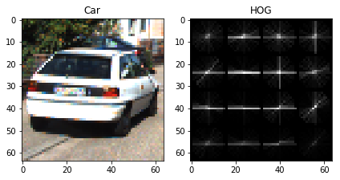
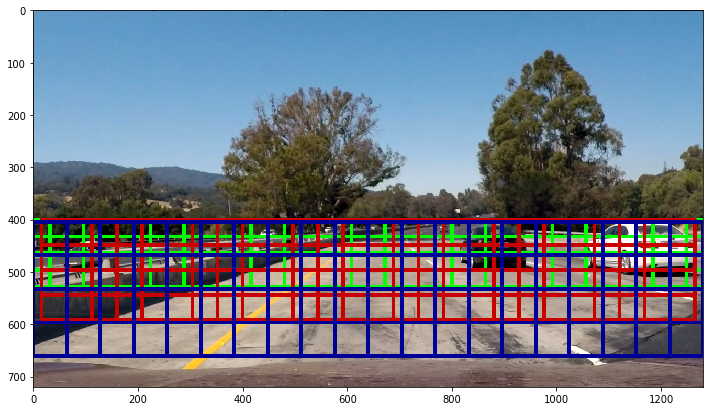
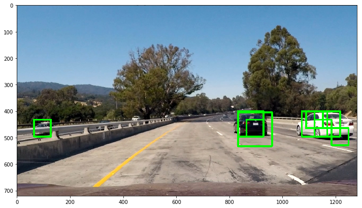
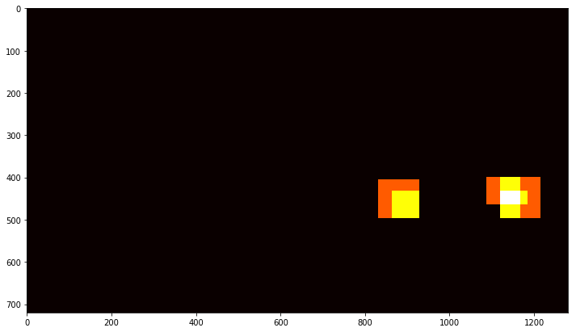
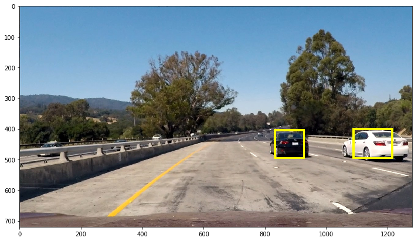
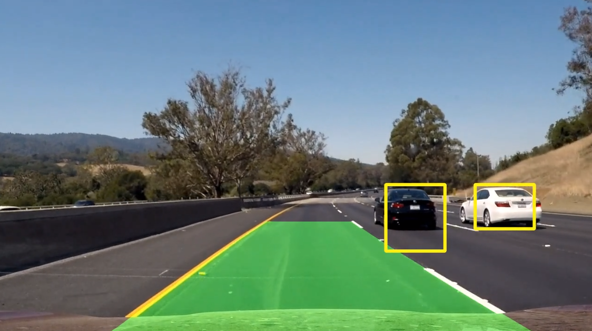

## Vehicle Detection Project

The steps of this project are the following:

* Perform a Histogram of Oriented Gradients (HOG) feature extraction on a labeled training set of images 
* Train a Linear SVM classifier
* Implement a sliding-window technique and use trained classifier to search for vehicles in images.
* Run pipeline on a video stream and create a heat map of recurring detections frame by frame to reject outliers 
and follow detected vehicles.
* Estimate a bounding box for vehicles detected

[Notebook visualizing steps](https://github.com/feklistoff/udacity-carnd-project5/blob/master/building_pipeline.ipynb)

## Histogram of Oriented Gradients (HOG)

### 1. Load the Training Data

In order to train a classifier we need training data. Initially we had two labeled sets at our disposal, `vehicle` with 
*8792* samples and `non-vehicle` with *8968* samples. In video we likely to see more non-vehicle area than vehicle. 
That means we need to predict non-vehicles more often. I increased the number of non-vehicle examples simply by flipping 
them horizontally and ended up with *17936* non-vehicle samples. I tried to use additional data from [Udacity labeled dataset](https://github.com/udacity/self-driving-car/tree/master/annotations) but it didn't improve accuracy of prediction (in fact it made it worse), so I stayed with *8792* vehicle samples and *17936* non-vehicle samles sets.

### 2. Extracting features

Apply HOG to all channels of the image (regardless of chosen color-space) turned out to be computationally expensive.
My goal was to be close to real-time video processing (at least several frames per second), that led me to choose only 
one channel to perform HOG and throw away the part with additional color and shape features extraction.

When we apply HOG to an image we get something like this:


And training image:



By trial and error I found these parameters to work best:

```python
color_space = 'YUV'
orient = 24  # HOG orientations
pix_per_cell = 16 # HOG pixels per cell
cell_per_block = 2 # HOG cells per block
hog_channel = 0 # image channel
```

## Classifier

I used a LinearSVC with penalty parameter C = 0.0005.
```
Using: 24 orientations 16 pixels per cell and 2 cells per block
Feature vector length: 864
5.46 Seconds to train SVC...
Test Accuracy of SVC =  0.9703
```
By the way, when I tried to apply HOG to all three channels of the training images I got accuracy of `98.6 %`. However, this wasn't acceptable because of a longer period of time needed to extract HOG features for three channels compared to one channel. 

## Sliding Window Search

### 1. Implementing Sliding Windows Search
I used the sliding window search method from the lesson materials. This efficient method for doing the sliding window approach, one that allows to only have to extract the HOG features once and then can be sub-sampled to get all of its overlaying windows. The method performs the classifier prediction on the HOG features for each window region and returns a list of rectangle objects corresponding to the windows that generated a positive prediction. Each window is defined by a scaling factor where a scale of 1 would result in a window that's 8 x 8 cells then the overlap of each window is in terms of the cell distance. It is possible to run this same function multiple times for different scale values to generate multiple-scaled search windows.

I used three layers of windows of different sizes - 64x64, 96x96, 128x128 (total number of windows - `249`):

```python
# 64x64 windows
y_start_small = 400
y_stop_small = 528
scale_small = 1.0
# 96x96 windows
y_start_med = 400
y_stop_med = 592
scale_med = 1.5
# 128x128 windows
y_start_big = 404
y_stop_big = 660
scale_big = 2.0
```



Function that's able to both extract features and make predictions (returns a list of windows where a car was detected):

```python
def find_cars(img, ystart, ystop, scale):    
  img_tosearch = img[ystart:ystop,:,:]
  ctrans_tosearch = convert_color(img_tosearch, color_space)
  # resize in order to fit in 64x64 patches (because clf was trained that way)
  if scale != 1:
      imshape = ctrans_tosearch.shape
      ctrans_tosearch = cv2.resize(ctrans_tosearch, (np.int(imshape[1]/scale), np.int(imshape[0]/scale)))

  ch = ctrans_tosearch[:,:,channel]

  # compute HOG features for the image
  hog_features = hog(ch, orient, (pix_per_cell, pix_per_cell),
                     (cell_per_block, cell_per_block),
                     transform_sqrt=True, feature_vector=False)

  # define blocks and steps
  nxblocks = (ctrans_tosearch.shape[1] // pix_per_cell) - cell_per_block + 1
  nyblocks = (ctrans_tosearch.shape[0] // pix_per_cell) - cell_per_block + 1 

  window = 64 # 64 was the orginal sampling rate, with 8 cells and 8 pix per cell
  nblocks_per_window = (window // pix_per_cell) - cell_per_block + 1
  cells_per_step = 2
  nxsteps = (nxblocks - nblocks_per_window) // cells_per_step
  nysteps = (nyblocks - nblocks_per_window) // cells_per_step

  windows_list = []

  for xb in range(nxsteps):
    for yb in range(nysteps):
      ypos = yb * cells_per_step
      xpos = xb * cells_per_step
      # extract HOG for this patch
      hog_feat = hog_features[ypos:ypos+nblocks_per_window, xpos:xpos+nblocks_per_window].ravel()

      xleft = xpos * pix_per_cell
      ytop = ypos * pix_per_cell

      # get features for classifier and predict
      features = X_scaler.transform(hog_feat.reshape(1, -1)) 
      prediction = svc.predict(features)

      if prediction:
          xwindow_left = np.int(xleft*scale)
          ytop_left = np.int(ytop*scale)
          length = np.int(window*scale)
          windows_list.append(((xwindow_left, ytop_left+ystart), (xwindow_left+length, ytop_left+length+ystart)))
    return windows_list
```

Windows with positive predictions:



### 2. Filtering Out Outliers

Sometimes we can see that overlapping detections exist not only for each of the two vehicles. Let's build a heat-map from these detections in order to combine overlapping detections and filter out false positives.

```python
def add_heat(heatmap, bbox_list):
  for box in bbox_list:
      # add += 1 for all pixels inside each bbox
      # assuming each "box" takes the form ((x1, y1), (x2, y2))
      heatmap[box[0][1]:box[1][1], box[0][0]:box[1][0]] += 1
  return heatmap
    
def heat_threshold(heatmap, threshold):
  # zero out pixels below the threshold
  heatmap[heatmap <= threshold] = 0
  return heatmap
```
```python
# add heat to each box in box list
heat = np.zeros_like(img[:,:,0]).astype(np.float)
heat = add_heat(heat, windows)
    
# apply threshold to help remove false positives
heat = heat_threshold(heat, 1)

# visualize the heatmap when displaying    
heatmap = np.clip(heat, 0, 255)

# find final boxes from heatmap using label function
labels = label(heatmap)
draw_img = draw_labeled_bboxes(np.copy(img), labels)
```

We get this heatmap:



And final result:



## Pipeline

After all described steps I got working pipeline. I put all functions into one class `VehicleTracker()` and defined function for pipeline:

```python
def vehicle_tracking(self, img):
    # search windows 64x64, 96x96 and 128x128
    windows_small = self.find_cars(img, self.y_start_small, self.y_stop_small, self.scale_small)
    windows_med = self.find_cars(img, self.y_start_med, self.y_stop_med, self.scale_med)
    windows_big = self.find_cars(img, self.y_start_big, self.y_stop_big, self.scale_big)
    windows = windows_small + windows_med + windows_big                    

    # if something found
    if len(windows) > 0:
        self.all_windows.append(windows)
        # wait for a few first frames to get more detections
        if len(self.all_windows) >= 5:
            heat = np.zeros_like(img[:,:,0]).astype(np.float)
            list_windows = [window for sublist in self.all_windows for window in sublist]
            heat = self.add_heat(heat, list_windows)
            heat = self.heat_threshold(heat, 1+int(len(list_windows)*1.7)) 
            heatmap = np.clip(heat, 0, 255)
            labels = label(heatmap)
            result = self.draw_labeled_bboxes(np.copy(img), labels)
            # keep size of buffer from growing (no more than 18 frames)
            if len(self.all_windows) > 18:
                self.all_windows.pop(0)
            return result
    elif len(self.all_windows) > 0:
        self.all_windows.pop(0)
    return img
```
As we can see I added `all_windows` as a buffer of previous 18 frames in order to fight jitter simply applying heatmap for a few frames and get less false positives when processing video. 

Also I took a lane detection pipeline from previous project and added to overall video-stream processing. [Here](https://github.com/feklistoff/udacity-carnd-project5/blob/master/vehicle_det_final.ipynb) all the code.

This function combines two parts:
```python
vehicle_tracker = VehicleTracker()
lane_tracker = LaneTracker()

def vehicle_and_lane(img):
  vehicle = vehicle_tracker.vehicle_tracking(np.copy(img))
  lane = lane_tracker.pipeline(np.copy(img))
  # combine vehicle detection and lane finding
  return cv2.addWeighted(vehicle, 1, lane, 0.5, 0)
```


## Conclusion

I managed to get a speed of video processing pipeline about 3 frames per second. Considering computationally expensive HOG feature extraction and lane detection, I think that even with slightly jittery [output video](https://github.com/feklistoff/udacity-carnd-project5/blob/master/out_video.mp4) it is a fairly good result.

There are definitely some ways of making this pipeline more robust. One such way might be using `multiprocessing` in `vehicle_and_lane` function in order to parallelize vehicle detection and lane detection. Another solution might be to use neural network for detecting cars instead of classical computer vision techniques. This would definitelly increase the speed and accuracy.
