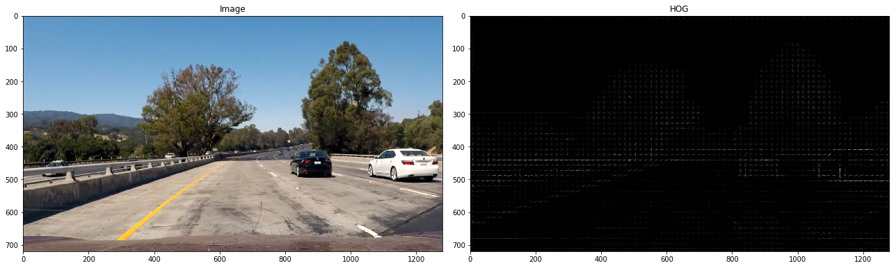

## Vehicle Detection Project


The steps of this project are the following:

* Perform a Histogram of Oriented Gradients (HOG) feature extraction on a labeled training set of images 
* Train a Linear SVM classifier
* Implement a sliding-window technique and use trained classifier to search for vehicles in images.
* Run pipeline on a video stream and create a heat map of recurring detections frame by frame to reject outliers 
and follow detected vehicles.
* Estimate a bounding box for vehicles detected


## Histogram of Oriented Gradients (HOG)


### 1. Load the Training Data

In order to train a classifier we need training data. Initially we had two labeled sets at our disposal, `vehicle` with 
*8792* samples and `non-vehicle` with *8968* samples. In video we likely to see more non-vehicle area than vehicle. 
That means we need to predict non-vehicles more often. I increased the number of non-vehicle examples simply by flipping 
them horizontally and ended up with *17936* non-vehicle samples.


### 2. Extracting features

Apply HOG to all channels of the image (regardless of chosen color-space) turned out to be computationally expensive.
My goal was to be close to real-time video processing (at least several frames per second), that led me to choose only 
one channel to perform HOG and throw away the part with additional color and shape features extraction.

When we apply HOG to an image we get something like this:



And training image:


By trial and error I found these parameters to work best:

```python
color_space = 'YUV'
orient = 24  # HOG orientations
pix_per_cell = 16 # HOG pixels per cell
cell_per_block = 2 # HOG cells per block
hog_channel = 0 # image channel
```

## Classifier

As a classifier a LinearSVC with penalty parameter C = 0.0005 was used.
```
Using: 24 orientations 16 pixels per cell and 2 cells per block
Feature vector length: 864
1.75 Seconds to train SVC...
Test Accuracy of SVC =  0.9652
```

## Sliding Window Search


